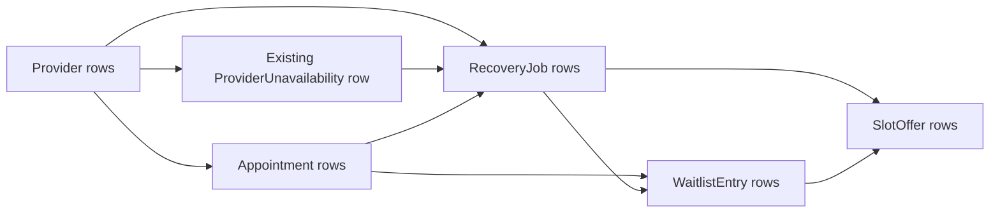

# Concurrency and Locking

## Scope of current guarantees

Workflow transaction entry points use PostgreSQL through Spring Data JPA at
`Isolation.READ_COMMITTED`. Correctness comes from three concrete layers:

1. explicit `PESSIMISTIC_WRITE` row locks on known mutable identities;
2. state, ownership, block, occupancy, and eligibility checks performed after those locks;
3. PostgreSQL constraints that reject final writes violating overlap, uniqueness, actor,
   or lifecycle invariants.

This is not equivalent to `SERIALIZABLE`. An unlocked discovery statement can observe a
different committed set from a later statement, and phantom rows are possible unless every
writer uses the same parent synchronization lock or a database constraint rejects the
write. PostgreSQL may also take internal locks for foreign keys, indexes, and exclusion
constraints that are not visible in the application lock DAG. The current test suite has
two true two-thread race tests; the remaining interleavings listed at the end require Step 7
coverage before they can be claimed as concurrently validated.

## Canonical lock DAG



The linear order used to reason about the graph is:

```text
Provider(s)
  -> ProviderUnavailability (only when an existing block is mutated)
  -> Appointment(s)
  -> RecoveryJob(s)
  -> WaitlistEntry(s)
  -> SlotOffer(s)
```

A transaction skips types it does not need. It must not lock a later type and then request
an earlier type. An insert has no pre-existing row to lock, but the transaction must still
hold the parent synchronization row before making the decision to insert.

## Same-type ordering rule

When a transaction needs multiple rows of one type, IDs are deduplicated and sorted
ascending before the repository call, and the locking JPQL also uses `ORDER BY id ASC`.
Current examples are:

- W3 and W4 sort Provider IDs before
  `ProviderRepository.findAllByIdInForUpdate(...)`.
- W4 deduplicates and sorts accepted/cleanup offer IDs before
  `SlotOfferRepository.findAllByIdInForUpdate(...)`.
- Waitlist reconciliation locks entries through
  `WaitlistEntryRepository.findByCurrentAppointmentIdAndStatusForUpdate(...)` and offers
  through `SlotOfferRepository.findByWaitlistEntryIdsAndStatusForUpdate(...)`; both order by
  ID.
- W14 locks jobs through
  `RecoveryJobRepository.findOpenOverlappingByProviderForUpdate(...)` and offers through
  `SlotOfferRepository.findOfferedByRecoveryJobIdsForUpdate(...)`; both order by ID.

Future batch lock methods must retain ascending ID ordering in the query. Sorting a Java
input list alone is insufficient if the database is free to return/lock rows in another
order.

## Complete pessimistic lock method inventory

Every method below uses `@Lock(LockModeType.PESSIMISTIC_WRITE)`.

| Repository method | Rows locked and order |
|---|---|
| `ProviderRepository.findByIdForUpdate(Long id)` | One Provider by primary key |
| `ProviderRepository.findAllByIdInForUpdate(List<Long> ids)` | Existing Providers in the supplied set, `ORDER BY p.id ASC` |
| `ProviderUnavailabilityRepository.findByIdForUpdate(Long id)` | One ProviderUnavailability by primary key |
| `AppointmentRepository.findByIdForUpdate(Long id)` | One Appointment by primary key |
| `RecoveryJobRepository.findByIdForUpdate(Long id)` | One RecoveryJob by primary key |
| `RecoveryJobRepository.findOpenOverlappingByProviderForUpdate(Long providerId, Instant blockStart, Instant blockEnd)` | OPEN jobs whose source Appointments overlap the provider interval, `ORDER BY j.id ASC` |
| `WaitlistEntryRepository.findByIdForUpdate(Long id)` | One WaitlistEntry by primary key |
| `WaitlistEntryRepository.findByCurrentAppointmentIdAndStatusForUpdate(Long appointmentId, WaitlistEntryStatus status)` | Entries for one anchor and status, `ORDER BY w.id ASC` |
| `SlotOfferRepository.findByIdForUpdate(Long id)` | One SlotOffer by primary key |
| `SlotOfferRepository.findAllByIdInForUpdate(List<Long> ids)` | Offers in an ID set, `ORDER BY s.id ASC` |
| `SlotOfferRepository.findByWaitlistEntryIdAndStatusForUpdate(Long waitlistEntryId, SlotOfferStatus status)` | Offers for one entry and status, `ORDER BY s.id ASC` |
| `SlotOfferRepository.findByWaitlistEntryIdsAndStatusForUpdate(List<Long> waitlistEntryIds, SlotOfferStatus status)` | Offers for an entry set and status, `ORDER BY s.id ASC` |
| `SlotOfferRepository.findOfferedByRecoveryJobIdsForUpdate(List<Long> recoveryJobIds)` | OFFERED offers for a job set, `ORDER BY s.id ASC` |

`AppointmentRepository.findScheduledOverlappingIds(...)`,
`AppointmentRepository.findScheduledOverlappingIdsForPatient(...)`, provider-block
existence queries, worker discovery/ranking queries, cleanup-discovery queries,
`SlotOfferRepository.existsPriorOfferForPatientAndJob(...)`, and ordinary `findById(...)`
calls do not carry `@Lock`.

## Per-workflow lock sequence

"Routing" means an unlocked read used to discover an earlier parent ID. "Insert" identifies
a new row rather than an acquired row lock.

| Workflow | Explicit lock sequence in the current code | Post-lock decision or dependent discovery |
|---|---|---|
| W1 Direct booking | Provider: `ProviderRepository.findByIdForUpdate(providerId)` -> insert Appointment | AppointmentType/specialty, ACTIVE-or-PENDING block, and clinic schedule are checked while Provider is held; exclusion constraints validate insert |
| W2 Cancellation | routing Appointment -> Provider `findByIdForUpdate` -> Appointment `findByIdForUpdate` -> ACTIVE anchored entries `findByCurrentAppointmentIdAndStatusForUpdate` ascending -> OFFERED child offers `findByWaitlistEntryIdsAndStatusForUpdate` ascending -> optional RecoveryJob insert | Appointment status/reason revalidated after Appointment lock; reconciliation discovers children after anchor lock; ACTIVE block decides job creation |
| W3 Direct reschedule | routing old Appointment -> old/new Providers `findAllByIdInForUpdate` ascending -> old Appointment `findByIdForUpdate` -> ACTIVE anchored entries ascending -> OFFERED child offers ascending -> replacement Appointment insert -> optional RecoveryJob insert | Destination type/block/schedule checked while Providers held; old status checked after Appointment lock; children discovered after anchor lock |
| W4 Offer acceptance, main transaction | routing offer/job/entry/old and source Appointments -> old/offered Providers `findAllByIdInForUpdate` ascending -> old Appointment `findByIdForUpdate` -> RecoveryJob `findByIdForUpdate` -> ACTIVE anchored entries `findByCurrentAppointmentIdAndStatusForUpdate` ascending -> accepted plus Category B/C/D offers `findAllByIdInForUpdate` ascending -> replacement Appointment/optional old-interval RecoveryJob inserts | Destination block checked while Providers held; old Appointment, job, entry, ownership, sibling, and accepted-offer state revalidated after locks; cleanup IDs discovered after parent locks |
| W4 patient-conflict cleanup | RecoveryJob `findByIdForUpdate` -> accepted SlotOffer `findByIdForUpdate` in a separate `REQUIRES_NEW` transaction | RecoveryJob is locked but never mutated; offer is cancelled only if still OFFERED |
| W5 Offer decline | SlotOffer `findByIdForUpdate` | Status must still be OFFERED |
| W6 Offer expiry | outer discovery has no lock; each processor transaction locks SlotOffer `findByIdForUpdate` | Status and `expiresAt <= Instant.now()` are checked after lock |
| W7 Waitlist creation | anchor Appointment `findByIdForUpdate` -> WaitlistEntry insert | Anchor status, patient, and type checked after lock; preferred Provider and type are unlocked reads |
| W8 Waitlist modification | routing WaitlistEntry -> anchor Appointment `findByIdForUpdate` -> WaitlistEntry `findByIdForUpdate` | Anchor status, entry status, and routed/locked anchor ID checked after locks; preferred Provider/type reads are unlocked |
| W9 Waitlist removal | WaitlistEntry `findByIdForUpdate` -> OFFERED offers `findByWaitlistEntryIdAndStatusForUpdate` ascending | Entry status checked before dependent offers are discovered and locked |
| W10 Completion | Appointment `findByIdForUpdate` -> ACTIVE anchored entries ascending -> OFFERED child offers ascending | Appointment status/time checked before reconciliation discovers children |
| W11 No-show | Appointment `findByIdForUpdate` -> ACTIVE anchored entries ascending -> OFFERED child offers ascending | Appointment status checked before reconciliation; no time check exists |
| W12 Recovery worker | unlocked oldest-job/routing reads -> released Provider `findByIdForUpdate` -> RecoveryJob `findByIdForUpdate` -> plain `existsByRecoveryJobIdAndStatus(..., OFFERED)` read -> selected WaitlistEntry `findByIdForUpdate` -> SlotOffer insert | The plain existence check acquires no SlotOffer lock; job classification follows Provider+Job locks; one candidate is selected then revalidated after its lock |
| W13A Accept on behalf | No separate path; when represented by W4, it uses the complete W4 main and cleanup sequences | Current service does not lock/load the actor User or enforce RECEPTIONIST role |
| W13B Scheduler reassign | unlocked SlotOffer -> RecoveryJob -> source Appointment routing reads -> released Provider `findByIdForUpdate` -> RecoveryJob `findByIdForUpdate` -> targeted SlotOffer `findByIdForUpdate` -> Appointment insert/flush | Job must be OPEN; offer terminal state is revalidated after its lock; no WaitlistEntry lock or post-job-lock offer-existence query is used |
| W14 Block request, conflicts | Provider `findByIdForUpdate` -> PENDING ProviderUnavailability insert | Scheduled conflicts are queried while Provider is held; no job/offer mutation occurs |
| W14 Block request, no conflicts | Provider `findByIdForUpdate` -> ACTIVE ProviderUnavailability insert -> overlapping OPEN RecoveryJobs `findOpenOverlappingByProviderForUpdate` ascending -> their OFFERED SlotOffers `findOfferedByRecoveryJobIdsForUpdate` ascending | Scheduled conflict discovery precedes block insert; suppression children are found while Provider is held |
| W14 Block activation | routing ProviderUnavailability -> Provider `findByIdForUpdate` -> ProviderUnavailability `findByIdForUpdate` -> overlapping OPEN RecoveryJobs ascending -> their OFFERED SlotOffers ascending | PENDING status and absence of scheduled conflicts are rechecked before activation and suppression |
| W14 Pending-block cancellation | ProviderUnavailability `findByIdForUpdate` only | PENDING status is checked after the block lock; Provider, RecoveryJob, and SlotOffer are neither read nor locked |

## Routing reads versus locked reads

A routing read answers "which parent must be locked first?" It is not authoritative for a
mutation. W2, W3, W4, W8, W12, and W14 activation use this technique because the target row
contains the foreign key needed to enter the lock hierarchy.

The service must treat state observed after the lock as authoritative:

- W2/W3 lock the routed Appointment and recheck `status=SCHEDULED`.
- W4 locks the old Appointment, RecoveryJob, active entry set, and offer set before checking
  their mutable states; ownership is checked before and after the entry lock.
- W8 locks the entry after its anchor and compares the locked `currentAppointmentId` to the
  routed ID, throwing `WaitlistEntryAnchorMismatchException` on change.
- W12 locks the selected job, verifies it is OPEN, and performs the plain
  `SlotOfferRepository.existsByRecoveryJobIdAndStatus(jobId, OFFERED)` read. If an OFFERED
  row now exists it returns `OFFER_ALREADY_EXISTS_FOR_JOB`; otherwise it locks and
  revalidates one candidate.
- W14 activation locks the block after Provider and checks that status remains PENDING.

Routing data can still expose gaps. W12 closes its known stale "no OFFERED offer" routing
gap with a plain existence check while holding the RecoveryJob lock. W3 builds the new
Appointment's patient ID from the routing Appointment; that source fact should be included
in the remaining Step 7 interleavings.

## Post-parent-lock dependent discovery

Dependent rows that will be mutated are selected after the parent synchronization row is
locked:

- W2, W3, W10, and W11 hold the Appointment before
  `WaitlistReconciliationCascade` selects ACTIVE WaitlistEntries and their OFFERED offers.
- W4 holds old Appointment and RecoveryJob before selecting active sibling entries,
  detecting fulfilled siblings, discovering Category B/C/D offer IDs, and locking the full
  offer set.
- W9 holds the WaitlistEntry before selecting OFFERED child offers.
- W14 holds Provider and, for activation, the existing ProviderUnavailability row before
  selecting overlapping OPEN RecoveryJobs and their OFFERED offers.

This rule only works when every competing writer uses the same parent lock. READ COMMITTED
does not prevent a child phantom inserted by code that bypasses the parent. The partial
offer index and appointment exclusions provide final protection for the current global
uniqueness/overlap cases; there is no general database constraint enforcing the complete
application lock protocol.

## Database constraints as final defense

The transaction protocol deliberately relies on these PostgreSQL definitions in
`src/main/resources/db/migration/V2__core_workflow_tables.sql`:

| Constraint/index | Final invariant | Service-visible result |
|---|---|---|
| `no_patient_overlap` | One patient has no overlapping SCHEDULED `[start_at,end_at)` ranges | W1/W3/W4 translate to `PatientDoubleBookedException`; W4 then runs separate offer cleanup |
| `no_provider_overlap` | One provider has no overlapping SCHEDULED ranges | W1/W3/W4 translate to `ProviderDoubleBookedException` |
| `one_offered_per_recovery` | One RecoveryJob has at most one OFFERED SlotOffer | Direct schema test proves rejection; W12 returns `OFFER_ALREADY_EXISTS_FOR_JOB` after its locked-parent check, while the index remains the final defense for noncompliant writers |
| unique `recovery_job.source_appointment_id` | One durable recovery identity per source Appointment | Duplicate insert fails; services do not translate the constraint to a domain exception |
| unique partial replacement index | One replacement link can be used once | Duplicate non-null `replaced_by_appointment_id` fails |
| appointment lifecycle checks | cancellation reason and replacement ID agree with status/reason | Invalid combinations fail the transaction |
| `audit_log_actor_valid` | USER has actor ID; SYSTEM has null actor ID | Incorrect audit attribution fails the transaction |

The exclusion constraints use half-open ranges, so an appointment ending exactly when
another starts is permitted. They apply only while status is SCHEDULED; terminal rows do
not consume capacity.

## Provider lock as the booking/block synchronization point

All current workflows that consume, release for recovery, classify, or block a provider's
capacity take Provider before their mutable child rows:

- W1 locks the destination Provider before validating/inserting.
- W2 locks the old Provider before cancelling and deciding whether to create a job.
- W3 locks both old and destination Providers before validation and replacement.
- W4 locks old and offered Providers before block/occupancy checks and acceptance.
- W12 locks the released Provider before classifying the job or selecting a candidate.
- W14 locks Provider before conflict discovery, request creation, activation, and job
  suppression. Pending-block cancellation deliberately locks only ProviderUnavailability
  because it never inspects Provider or changes RecoveryJob/SlotOffer state.

If a booking and block operation target the same Provider, the Provider row is the intended
serialization point. The waiter runs block/availability/conflict queries only after the
winner commits. This protects the implemented paths; arbitrary inserts that bypass these
services still depend on appointment constraints and may ignore unavailability semantics.

## Patient-overlap handling

There is no patient row lock in booking workflows. PostgreSQL `no_patient_overlap` is the
authoritative race defense.

- W1 and W3 flush the new Appointment, translate the constraint to
  `PatientDoubleBookedException`, and roll back every mutation/audit in that transaction.
- W4 also rolls back the complete main acceptance transaction. Only after rollback does
  `OfferAcceptanceOrchestrator` invoke
  `OfferAcceptancePatientConflictCleanup.cleanupAfterPatientConflict(...)` in a separate
  `REQUIRES_NEW` transaction. That transaction locks RecoveryJob then SlotOffer, leaves the
  job unchanged, and changes the offer to CANCELLED with audit
  `SlotOffer`/`CANCEL`/`PATIENT_SCHEDULE_CONFLICT` only if the offer is still OFFERED.
- W12 prefilters and rechecks scheduled patient overlap before creating an offer, but offer
  creation does not itself book the Appointment; W4 repeats the final booking through the
  exclusion constraint.

Step 7 must prove simultaneous same-patient bookings and W4 acceptance against another
booking. Only same-provider direct booking is currently exercised with actual threads.

## Provider-overlap handling

The Provider row orders current capacity-changing workflows, and
`no_provider_overlap` remains the final write defense.

- W1/W3 do not query existing Appointments before insert; they depend on Provider ordering
  among compliant services and translate a final `no_provider_overlap` failure to
  `ProviderDoubleBookedException`.
- W4 queries `AppointmentRepository.findScheduledOverlappingIds(...)` while the offered
  Provider lock is held. If occupied, it commits offer CANCELLED plus
  `SlotOffer`/`CANCEL`/`PROVIDER_INTERVAL_OCCUPIED`, commits job FILLED plus
  `RecoveryJob`/`FILLED`/null, and throws `ProviderIntervalOccupiedException` under
  `noRollbackFor`. A constraint failure that still occurs is translated to
  `ProviderDoubleBookedException` and rolls back.
- W12 occupancy classification while Provider+Job are locked turns the job FILLED and
  writes `RecoveryJob`/`FILLED`/`INTERVAL_ALREADY_OCCUPIED`.
- W14 conflict discovery while Provider is locked decides PENDING versus ACTIVE.

## W4 conflict and cleanup transaction boundaries

The W4 main transaction is permitted to commit after two exceptions only:

- `OfferExpiredException` after an OFFERED stale offer becomes EXPIRED and receives the
  SYSTEM `SlotOffer`/`EXPIRE`/null audit;
- `ProviderIntervalOccupiedException` after the accepted offer becomes CANCELLED, the job
  becomes FILLED, their audits are written, and Category B/C/D OFFERED offers have already
  been cancelled as `SUPERSEDED_BY_ACCEPTANCE`.

`PatientDoubleBookedException` is intentionally absent from `noRollbackFor`. Its main
transaction rolls back before the separate `REQUIRES_NEW` cleanup starts. The separate
method locks RecoveryJob before SlotOffer to preserve the canonical order, makes no job
mutation, rechecks `offer.status=OFFERED`, and refuses to overwrite ACCEPTED, DECLINED,
EXPIRED, or CANCELLED.

The helper tests prove commit-versus-rollback behavior with sequential transaction
boundaries. They do not yet prove simultaneous accept/decline/expiry interleavings.

## W13B transaction and rollback boundary

`SchedulerReassignmentService.reassignSlot(...)` performs unlocked routing reads of the
target SlotOffer, its RecoveryJob, and the job's source Appointment. The authoritative lock
sequence is:

1. `ProviderRepository.findByIdForUpdate(offeredProviderId)`;
2. `RecoveryJobRepository.findByIdForUpdate(recoveryJobId)`;
3. `SlotOfferRepository.findByIdForUpdate(existingSlotOfferId)`.

The locked job must still be OPEN or `RecoveryJobNotOpenException` is thrown. The locked
offer is passed to `AcceptedOfferTerminalStateResolver`: ACCEPTED throws
`OfferAlreadyAcceptedException`; DECLINED or CANCELLED throws
`OfferAlreadyResolvedException`; EXPIRED throws `OfferExpiredException`; stale OFFERED
becomes EXPIRED with a SYSTEM `SlotOffer`/`EXPIRE`/null audit and then throws
`OfferExpiredException`; unexpired OFFERED proceeds. The transaction declares
`noRollbackFor=OfferExpiredException`, so only the aggressive stale-offer transition commits
after a thrown exception.

The service never locks the WaitlistEntry and never calls
`existsByRecoveryJobIdAndStatus(...)`. The targeted offer and the
`one_offered_per_recovery` unique index are why a W12-style existence recheck is not needed.
After eligibility validation, the Appointment insert is flushed before offer/job mutation.
`ProviderDoubleBookedException`, `PatientDoubleBookedException`, and any unrecognized
`DataIntegrityViolationException` roll back normally. Success changes the offer to
CANCELLED with `SlotOffer`/`CANCEL`/`STAFF_OVERRIDE`, changes the job to FILLED with
`RecoveryJob`/`FILLED`/null, inserts the replacement Appointment with
`Appointment`/`CREATE`/null, and attributes all three audits to USER/the supplied actor ID.

## W14 pending-block cancellation boundary

`ProviderBlockCancellationService.cancelPendingBlock(...)` directly calls
`ProviderUnavailabilityRepository.findByIdForUpdate(providerUnavailabilityId)`. This is its
only business-row lock. It does not perform an unlocked Provider routing read and does not
call `ProviderRepository`, `RecoveryJobRepository`, or `SlotOfferRepository`.

The locked status is authoritative. PENDING changes to CANCELLED and gets a
microsecond-truncated `cancelledAt`; ACTIVE and CANCELLED throw
`ProviderBlockNotPendingException`; a missing row throws
`ProviderUnavailabilityNotFoundException`. Rejections roll back without an audit. Success
writes exactly one `ProviderUnavailability`/`CANCEL` audit whose reason is the nullable
`cancellationReason` argument. Actor attribution is SYSTEM/null for a null actor ID and
USER/the supplied ID otherwise. The block's original `reason` remains unchanged.

Activation and cancellation can both lock the same ProviderUnavailability row without a
lock cycle. Activation takes Provider before it waits for the block; cancellation never
requests Provider after holding the block. Whichever operation obtains the block lock first
can complete its PENDING transition, and the waiter then sees ACTIVE or CANCELLED and throws
`ProviderBlockNotPendingException`.

## W12 stale-candidate behavior

W12 performs an unlocked ranked query, then locks one WaitlistEntry by ID. The locked row
is rechecked for:

- ACTIVE status;
- released AppointmentType equality;
- inclusive clinic-local date window;
- anchor existence, SCHEDULED status, and same patient;
- `releasedEndAt <= anchor.startAt`;
- no scheduled patient overlap;
- no historical offer of any status for this patient and RecoveryJob.

If any check fails, `attemptRecovery()` returns `CANDIDATE_BECAME_STALE`. RecoveryJob stays
OPEN; no SlotOffer and no AuditLog is inserted; no second candidate is attempted in the
same transaction. A later poll can rank again. This behavior limits lock duration but means
a stale top candidate can defer recovery by at least one worker interval.

## Already concurrent-tested behavior

`DirectBookingServiceTest.concurrentOverlappingProviderBookingsProduceOneWinner` uses a fixed
two-thread `ExecutorService`, waits for both tasks with a ready `CountDownLatch`, releases
them with a start `CountDownLatch`, and checks that one booking succeeds while the other
gets `ProviderDoubleBookedException`.

`RecoveryWorkerServiceTest.concurrentWorkersCreateOneOfferAndReturnHandledRaceOutcome`
uses the same executor-and-latch structure for two real `attemptRecovery()` transactions.
Both Futures are read with bounded `get(...)` calls. The outcome multiset is exactly one
`OFFER_CREATED` and one `OFFER_ALREADY_EXISTS_FOR_JOB`, and exactly one SlotOffer row is
committed. Other transaction-boundary tests are sequential unless identified otherwise.

## Step 7 race-matrix TODO

Each scenario below needs a PostgreSQL 15 Testcontainers test with explicit starting state,
two transaction tasks, controlled latches/barriers around the intended serialization
point, bounded future waits, expected winner/loser result, final database rows/audits, and a
deadlock/timeout assertion.

RM-09 and RM-10 were adapted from the original `RACE_MATRIX_ANALYSIS_RESULTS.md` prose to
match Correction 6, which is already implemented: both PENDING and ACTIVE blocks stop new
direct bookings and W12 offer creation. RM-09 therefore starts with a PENDING block rather
than the contradictory ACTIVE block awaiting activation. RM-10 races booking against block
creation rather than activation, because a pre-existing PENDING block would already reject
the booking and make the original booking-versus-activation framing non-racy.

1. **Accept offer A versus accept offer A.** Prove the offer row's terminal state has one
   winner; the waiter reports `OfferAlreadyAcceptedException` or another exact state-driven
   outcome and no duplicate Appointment/job/audit cascade commits.
2. **Accept offer A versus decline offer A.** Prove the locked SlotOffer serializes ACCEPTED
   and DECLINED so exactly one terminal transition and its audit commits.
3. **Accept offer A versus expiry of A.** Prove the locked offer ends either ACCEPTED or
   EXPIRED according to lock winner and post-lock time/state, with no duplicate expiry or
   acceptance audit.
4. **Accept offer A versus accept offer B for the same patient/old Appointment.** Prove old
   Appointment and active-entry locks permit at most one move/FULFILLED entry and that
   sibling/cleanup rows reach the specified final states.
5. **Cancellation versus reschedule of one Appointment.** Prove the Appointment lock gives
   one `SCHEDULED -> CANCELLED` winner, the waiter gets
   `AppointmentNotScheduledException`, and at most one RecoveryJob exists because
   `recovery_job.source_appointment_id` is unique.
6. **Two direct bookings for the same provider and interval.** Retain the existing true
   concurrent test and extend final audit/row assertions if the race matrix requires them.
7. **Two direct bookings for the same patient and interval with different Providers.**
   Prove `no_patient_overlap` gives one winner and one `PatientDoubleBookedException`; there
   is no patient row lock.
8. **Provider-block request while conflicting booking commits.** Prove the shared Provider
   lock makes the request see the committed Appointment and create PENDING, or lets the
   ACTIVE block make the booking fail with `ProviderUnavailableException`.
9. **Block activation versus recovery offer generation.** Prove Provider serialization
   leaves an activated block with overlapping job SUPPRESSED and actionable offers
   CANCELLED, or makes the worker observe ACTIVE and return
   `PROVIDER_ACTIVELY_BLOCKED`.
10. **Block activation versus direct booking.** Prove the winner at Provider determines
    whether activation sees an unresolved conflict or booking sees ACTIVE/PENDING
    unavailability; no successful ACTIVE block and overlapping SCHEDULED Appointment should
    emerge from compliant paths.
11. **Recovery generation versus waitlist removal.** Prove WaitlistEntry lock/revalidation
    prevents an OFFERED offer from being committed for a REMOVED candidate, or that removal
    subsequently locks and cancels the created offer as `ENTRY_REMOVED`.
12. **Offer acceptance versus sibling WaitlistEntry removal.** Prove the old Appointment,
    WaitlistEntry, and SlotOffer order has no reverse-lock deadlock and produces one
    consistent FULFILLED/REMOVED/offer cleanup result.
13. **Selected worker candidate changes before its lock.** Mutate status, date, anchor, or
    patient conflict between ranking and lock; prove `CANDIDATE_BECAME_STALE`, OPEN job, no
    offer, no audit, and no second candidate attempt.
14. **Permanently ineligible candidate prefilter.** Run worker selection while excluded rows
    exist and prove they are never chosen; isolate status, anchor, strict-earlier, conflict,
    and historical-offer predicates.
15. **Offer acceptance versus a separate patient booking.** Force the W4 Appointment insert
    to lose `no_patient_overlap`; prove the main transaction rolls back before the
    `REQUIRES_NEW` cleanup commits only accepted-offer CANCELLED plus
    `SlotOffer`/`CANCEL`/`PATIENT_SCHEDULE_CONFLICT`, preserving RecoveryJob state.

16. **W13B reassignment versus W4 acceptance of the same offer.** Prove the common released
    Provider and RecoveryJob serialization produces one winner. If W4 wins, W13B must see a
    non-OPEN job and throw `RecoveryJobNotOpenException`; if W13B wins, W4 must see the
    FILLED job and throw `RecoveryJobNotOpenException`. Assert one replacement Appointment,
    one terminal offer result, one FILLED job, and only the winner's audit set.

17. **W13B reassignment versus decline of the same offer.** Prove one terminal transition
    wins the SlotOffer lock. If decline wins, W13B must throw `OfferAlreadyResolvedException`
    for DECLINED and leave the job OPEN; if reassignment wins, decline must throw
    `SlotOfferNotOfferedException` for CANCELLED while the W13B Appointment and FILLED job
    remain committed.

18. **W14 activation versus cancellation of the same PENDING block.** Prove exactly one
    transition wins the ProviderUnavailability lock. If activation wins, cancellation must
    throw `ProviderBlockNotPendingException` with ACTIVE; if cancellation wins, activation
    must throw the same exception with CANCELLED. Assert only the winner's audit and verify
    that cancellation never changes a RecoveryJob or SlotOffer.

W13B and W14 pending-block cancellation now have sequential transaction coverage but no
true two-thread tests for their listed interleavings.
